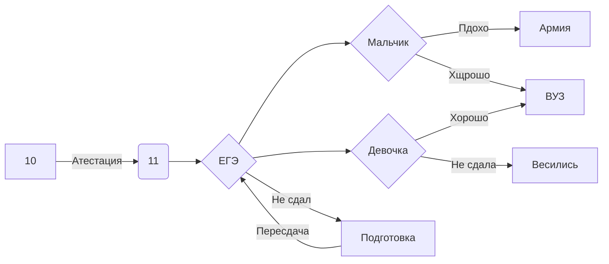

# chtoto_po_pytonu
## Boslavu Gleba
## Шумилов Евгений 031 тестер и аналитик
> Назвае проэкта:
> 

SELECT  COUNT(*) FROM INFORMATION_SCHEMA.TABLES WHERE TABLE_TYPE = 'BASE TABLE' сколько таблиц в бд

SELECT FROM users вывести данные одного столбца

SELECT FROM grades

SELECT* FROM grades JOIN users ON users.user_id=grades.user_id ВЫВЕСТИ ДАННЫЕ НЕСКОЬКИХ СТОЛБЦОВ

Назввание сайтаж
## GenekBeliki.gethub.io

# Шпоры:
<fasgad.ipynb>

$$U1=\sqrt{gR}=\sqrt{\frac{GM}{R}}$$
Движение небесных тел и их искусственных спутников. Первая 
космическая скорость

Вторая космическая скорость:
$$U2=\sqrt{2}U1=\sqrt{\frac{2GM}{R}}$$

#### R-Радиус земли

Давление:
$$p=\frac{F\bot }{S}$$

<iframe width="768" height="432" src="https://miro.com/app/live-embed/uXjVPB3RDH8=/?moveToViewport=-540,-367,1497,771&embedId=820559811757" frameborder="0" scrolling="no" allowfullscreen></iframe>

## Инструкция по фотоаппарату(Интерактивная):

https://view.genial.ly/637b93225ba2af001afa3b34/interactive-image-copy-interactive-image

## Мой Сайт на Tilda
http://project6507957.tilda.ws/page32540080.html
